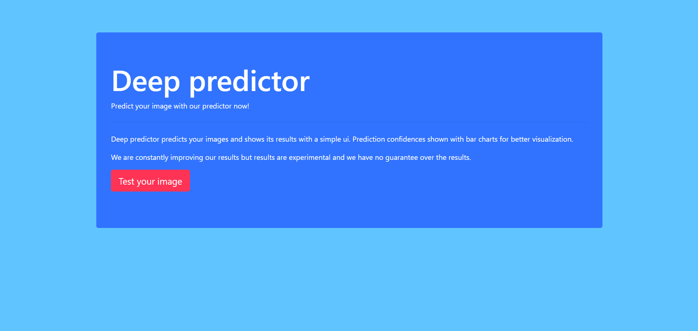

# deep predictor
### A simple backend for image prediction tasks that uses deep learning.

***

  [](https://github.com/cccaaannn/deep_predictor/blob/master/LICENSE) 


## **Table of contents**
- [Features](#Features)
- [Setting it up](#Setting-it-up)
- [Setting up deep_predictor.cfg](#Setting-up-`deep_predictor.cfg`)
- [Adding a new model](#Adding-a-new-model)
- [Running the application](#Running-the-application)
- [Supported deep learning backends](#Supported-deep-learning-backends)
- [Configurations](#Configurations)
- [Custom frontend and Api](#Custom-frontend-and-Api)
- [Test api](#Test-api)
- [Api response examples](#Api-response-examples)
- [Prediction status codes](#Prediction-status-codes)
- [Predicted images save structure](#Predicted-images-save-structure)
- [How it looks](#How-it-looks)

</br>

## Features
- Supports multiple models running at the same time. [supported deep learning backends](#Supported-deep-learning-backends)
- Easy to configure for new models. [adding a new model](#Adding-a-new-model)
- Saves detailed info about model and prediction to the database.
- Organizes predicted images by saving them to folders named by most confident class names. [predicted images save structure](#Predicted-images-save-structure)
- Simple api style works with client side id, no need for login-register. [Custom frontend and Api](#Custom-frontend-and-Api)
- Test api. [test api](#Test-api)
- Example minimalist frontend. [how it looks](#How-it-looks)

</br>

## Setting it up
1. Train your models. [supported deep learning backends](#Supported-deep-learning-backends)
2. Install requirements for your os.
    - It would be less problematic if you use same tensorflow and keras versions that you used to train your models.
3. Prepare the `deep_predictor.cfg`. [setting up deep_predictor.cfg](#Setting-up-`deep_predictor.cfg`)
4. Add your models. [adding a new model](#Adding-a-new-model)
5. Run deep predictor. [running the application](#Running-the-application)

</br>

## Setting up `deep_predictor.cfg`
1. Generate a secret key for flask.
2. Generate api_key for both production and test.
3. Add recaptcha keys.
4. Add models. [adding a new model](#Adding-a-new-model)
- You can use `other/generate_secret_key.py` to generate keys.

</br>

## Adding a new model
1. Create a cfg file for the new model with using cfg template under `cfg/predictor/templates`. [supported deep learning backends](#Supported-deep-learning-backends)
2. Fill the fields in the cfg template according to specifications of the new model.
3. Find a frontend name for your model.
4. Make a `"name":"cfg_path"` combination for your model and add it to `"production":"prediction_options":"predictors"` field inside `deep_predictor.cfg`. [full example below](#Full-example-from-`deep_predictor.cfg`)
5. Chose a default predictor and set `default_predictor_name`.
    - Default predictor will run if the `model_name` field is posted empty from the frontend.

- For adding a model to [test api](#Test-api) just add your models `"name":"cfg_path"` combination to `"test":"prediction_options":"predictors"` field inside `deep_predictor.cfg`. [full example below](#Full-example-from-`deep_predictor.cfg`) 

**Deep predictor runs all models added under predictors.**

#### **Full example from `deep_predictor.cfg`**
```json
"production" : {
.
.
  "prediction_options":{
      "default_predictor_name" : "vgg16",
      "predictors" : {
          "vgg16" : "deep_predictor/cfg/predictors/vgg16.cfg",
          "densenet" : "deep_predictor/cfg/predictors/densenet201.cfg"
      }
  }
}
"test" : {
.
.
  "prediction_options":{
      "predictors" : {
          "vgg16" : "deep_predictor/cfg/predictors/test_predictors/vgg16.cfg",
          "densenet" : "deep_predictor/cfg/predictors/test_predictors/densenet201.cfg"
      }
  }
}
```

</br>

## Running the application
1. `waitress_server.py` will run the app on production.
2. Directly running `flask_app.py` will run the app on development.
- If you have multiple `deep_predictor.cfg` files with different name or paths, pass the path of your file to `create_app` function.

</br>

## Supported deep learning backends
- Right now deep predictor supports regular `keras cnn` models and tensorflow converted `darknet yolo` models.
    - [Darknet](https://github.com/Alexeyab/darknet).
    - For converting yolo models you can use [tensorflow-yolov4-tflite github](https://github.com/hunglc007/tensorflow-yolov4-tflite).
- Tested keras and tensorflow versions are in the requirements.

</br>

## Configurations
- `deep_predictor.cfg`
  - This is the main config file and it is usable as a template.
  - It has a lot of options for both production and test. 
  - This file or a file with same parameters has to be passed to `create_app` function in order for app to run. [running the application](#Running-the-application)
- `loggers.cfg`
  - Logger names, logging levels and log files paths also can be modified from this file.

</br>

## Custom frontend and Api
To make a custom frontend
1. Post required fields with these form names to `/upload`.
    1. `prediction_id`
        - String unique id, length can be modified from `deep_predictor.cfg`.
    2. `model_name`
        - Model names can be modified from `deep_predictor.cfg`.
        - You can get running model names from `/api?predictors`. [predictors result example](#Predictors-result-example)
        - If you post ths empty `default_predictor_name` will run. [adding a new model](#Adding-a-new-model)
    3. `image`
        - Accepted image extensions can be modified from `deep_predictor.cfg`.
    4. `g-recaptcha-response` or `api_key`
        - Recaptcha keys can be modified from `deep_predictor.cfg`.
        - `api_key` can be modified from `deep_predictor.cfg`.
2. Get the result from `/api?prediction_id=<prediction_id>` as json. [api response examples](#Api-response-examples)

- If you want to make predictions from frontend that does not support recaptcha, you can use `api_key` instead of recaptcha. 
- You can also use prediction status codes to make a better error output for frontend than I did 🤷🏻‍♂️. [prediction status codes](#Prediction-status-codes)

</br>

## Test api
- `/test-upload` and `/test-api` endpoints are provided, they require same parameters as `/upload` and `/api`.
- Test api uses test database and test predictors that defined in the `deep_predictor.cfg` file's `test` section. 
- You can use those endpoints to make tests during production without bloating the database or saved images paths. Ex: `test/test_is_up.py`.
- Test predictors are invisible to frontend, but you can use `/test-api?predictors` to get test predictors.
- You can use `/test-api?prediction_id=<prediction_id>` to get test prediction result.
- See [adding a new model](#Adding-a-new-model) for adding models to test api.

</br>

### Api response examples

#### Successful keras prediction result
```json
{
  "model_info": {
    "method": "vgg16",
    "model_id": 100,
    "predictor_backend": "keras"
  },
  "prediction_id": "XC9ZNaDT2nfFaORUIeXSBims3WcdLJRS",
  "prediction_status": 200,
  "prediction_time": 1604856542,
  "predictions": [
    {
      "class_index": 6,
      "class_name": "soup",
      "confidence": 0.97628
    },
    {
      "class_index": 4,
      "class_name": "apple",
      "confidence": 0.02319
    },
    {
      "class_index": 9,
      "class_name": "dessert",
      "confidence": 0.00041
    }
  ]
}
```

#### Successful tf_yolo prediction result
```json
{
  "model_info": {
    "method": "yolov4",
    "model_id": 4000,
    "predictor_backend": "tf_yolo"
  },
  "prediction_id": "zRnzAQCgs5rvkRnILtfz4nSYa1D56jCA",
  "prediction_status": 200,
  "prediction_time": 1604856413,
  "predictions": [
    {
      "bbox": { "cx": 0.28939, "cy": 0.66856, "h": 0.53053, "w": 0.23469 },
      "class_name": "Dog",
      "confidence": 0.98514
    },
    {
      "bbox": { "cx": 0.75476, "cy": 0.21471, "h": 0.16953, "w": 0.29614 },
      "class_name": "Truck",
      "confidence": 0.92009
    }
  ]
}
```
#### Failed prediction result
```json
{
  "model_info": {
    "method": "vgg16",
    "model_id": 100,
    "predictor_backend": "keras"
  },
  "prediction_id": "tr0S8H0RYwRsAYeCGlDsH4JQOHZ1Q0tH",
  "prediction_status": 510,
  "prediction_time": 1604857137,
  "predictions": ""
}
```


#### Predictors result example
```json
{
  "predictors": [
    "vgg16",
    "ms coco"
  ]
}
```


#### Prediction status codes
```
0 = prediction not exists
100 = predicting
200 = predicted successfully

predictor errors
500 = general prediction error
510 = image is not supported
520 = prediction cannot converted to json
530 = predicted image could not been saved, moved or deleted
550 = predictor backend not inited or crashed
560 = tensorflow version not supported
570 = predictor backend is not supported
```


### Predicted images save structure
```
|---densenet201
|   |---Kebap
|   |---Soup
|   |---not-confident
|   ...
|---vgg16
    |---Cookie
    |---Kebap
    |---Rice
    |---Soup
    |---Dessert
    |---not-confident
    ...
```


</br>

## How it looks


 

</br>

## Results pages


</br>

## Mobile
   

</br>
